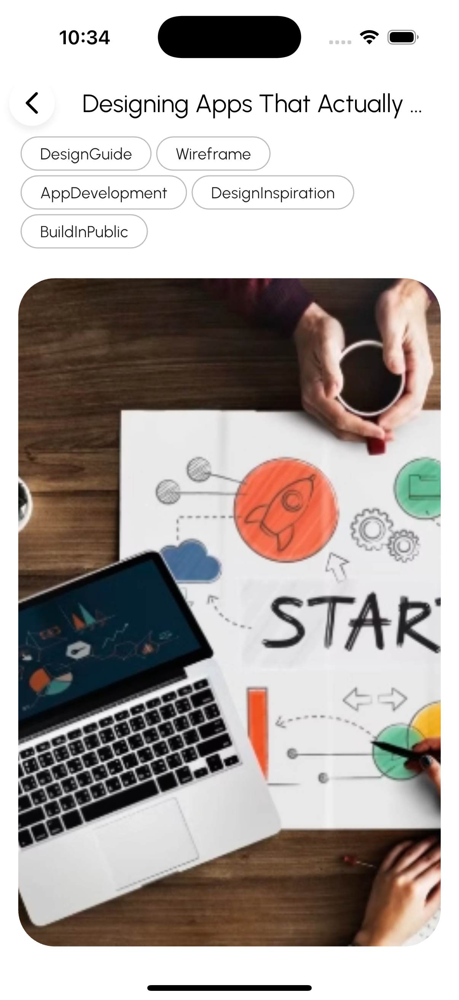
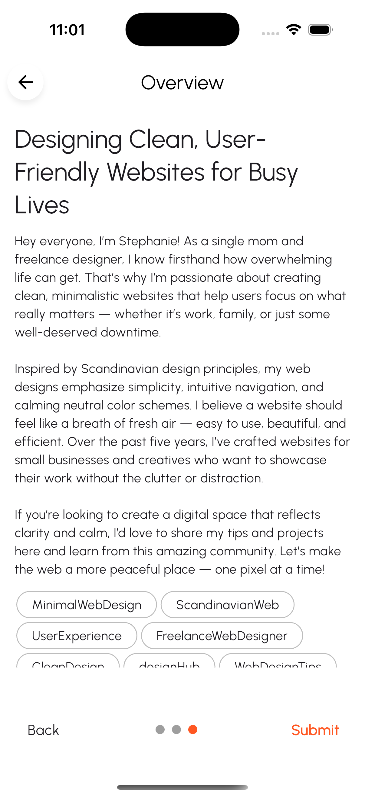
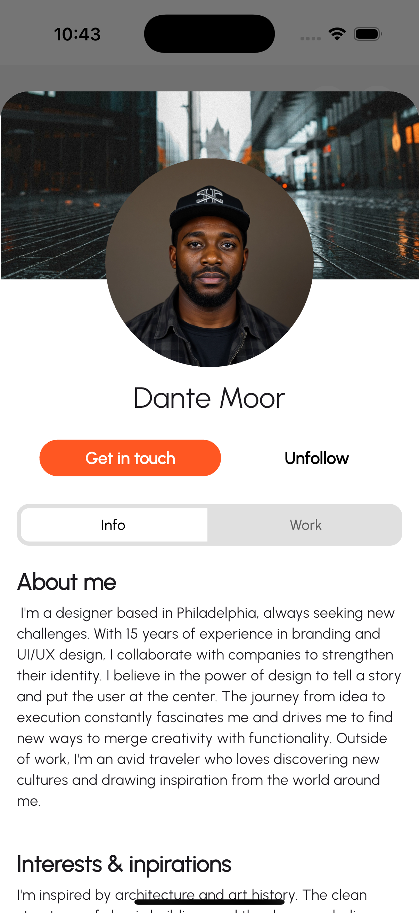

# designhub

**designhub** is a modern social media app built with Flutter, tailored for designers and creatives. It enables users to showcase their work, get meaningful feedback, connect with like-minded individuals, and request design help in real-time. The platform is crafted to inspire creativity, support collaboration, and foster a strong design community.

---
## Navigation

Use this quick index to jump directly to key sections of the README:

- [Features](#features)  
- [Technology Stack](#technology-stack)  
- [Getting Started](#getting-started)  
- [Screenshots](#screenshots)  
  - [Login & Registration](#login--registration)  
  - [Home Feed](#home-feed)  
  - [Search](#search)  
  - [Posts](#posts)  
  - [Create New Posts](#create-new-posts)  
  - [SOS Feature](#sos-feature)  
  - [News & Chat](#news--chat)  
  - [Profile & External Profiles](#profile--external-profiles)  
- [Access](#access)  
- [About](#about)  

---

## Features

- Create, view, and manage design posts with images, titles, tags, and optional questions  
- Save and organize your favorite posts  
- Explore curated design news and community content  
- Publish SOS posts to request urgent feedback or creative help  
- Connect with peers via 1:1 chat for SOS requests  
- Fully browsable and editable user profiles (info, posts, saved items, SOS history)  
- Powerful search across posts, users, and SOS requests using content and hashtags  
- Smooth state updates using `Provider` and `ChangeNotifier`  
- Image uploads and hosting through Firebase Storage  
- Real-time post feeds and chat using Firestore  

---

## Technology Stack

- **Flutter & Dart** — cross-platform mobile development  
- **Firebase Suite**:  
  - Authentication  
  - Firestore (real-time database)  
  - Storage (media handling)  
  - Messaging (push notifications)  
- **State Management**: Provider  
- **Image Handling**: cached_network_image, image_picker, flutter_image_compress  
- **UI/UX Components**:  
  - Custom Widgets  
  - Google Fonts  
  - PhotoView for interactive image zoom  
- **Other Packages**:  
  - flutter_svg  
  - link_text  
  - app_settings  

---

## Getting Started

1. Clone the repository  
2. Run `flutter pub get`  
3. Connect your Firebase project  
4. Launch the app using `flutter run` on your emulator or physical device  

---

## Screenshots

Explore the visual journey through **designhub**’s interface and core functionality.

### Login & Registration  
Start your journey with a secure login and quick email-based sign-up. The clean and intuitive forms provide a seamless onboarding experience.

<table>
  <tr>
    <td align="center"> Login screen</td>
    <td align="center"> Registration form</td>
  </tr>
</table>

---

### Home Feed  
Browse a curated feed of posts from the creative community. Scroll through visual inspiration, save your favorite posts, or dive into discussions.

<table>
  <tr>
    <td align="center"> Community feed</td>
  </tr>
</table>

---

### Search  
Use intelligent search to quickly find design posts, SOS requests, or other users. Searches work with titles, tags, names, and content.

<table>
  <tr>
    <td align="center"> Search by post</td>
    <td align="center"> Search SOS requests</td>
    <td align="center"> Search user profiles</td>
  </tr>
</table>

---

### Posts  
Explore design posts in depth. View images in detail, read and post comments, and interact with fellow creatives.

<table>
  <tr>
    <td align="center"> Post detail view</td>
    <td align="center"> Expanded post view</td>
    <td align="center"> Comments section</td>
  </tr>
</table>

---

### Create New Posts  
Build your own post from scratch. Add a title, description, hashtags, and images—then preview it all before publishing.

<table>
  <tr>
    <td align="center"> Start with an empty form</td>
    <td align="center"> Add title, description, and hashtags</td>
  </tr>
  <tr>
    <td align="center"> Image upload section</td>
    <td align="center"> Select images with picker</td>
    <td align="center"> Selected image overview</td>
  </tr>
  <tr>
    <td align="center"> Final post preview</td>
    <td align="center"> Final post with images</td>
  </tr>
</table>

---

### SOS Feature  
In moments when quick feedback or urgent help is needed, publish an SOS request. Designers can respond directly via comments or chat.

<table>
  <tr>
    <td align="center"> SOS overview</td>
    <td align="center"> Detailed SOS post</td>
    <td align="center"> Community responses</td>
  </tr>
</table>

---

### News & Chat  
Stay updated with the latest design trends and engage in direct 1:1 conversations through the integrated chat system.

<table>
  <tr>
    <td align="center"> Design news overview</td>
    <td align="center"> Chat interface</td>
    <td align="center"> Real-time messaging</td>
  </tr>
</table>

---

### Profile & External Profiles  
Manage your personal design identity and explore profiles of other creatives. View their posts, saved work, and SOS activity.

<table>
  <tr>
    <td align="center"> Your profile information</td>
    <td align="center"> Edit your profile</td>
  </tr>
  <tr>
    <td align="center"> Published work</td>
    <td align="center"> Saved posts</td>
    <td align="center"> Your SOS history</td>
  </tr>
  <tr>
    <td align="center"> View other profiles</td>
  </tr>
</table>

---

## Access

There is no public release at this time.  
To request beta access for **iOS (via TestFlight)** or **Android**, please reach out via email:

**bennyfischer22@googlemail.com**

---

## About

**designhub** was created as part of a personal development project with a focus on design-centric collaboration. The goal was to build a space where creatives can not only present their work but also get real-time help and feedback. The app leverages a modular architecture, thoughtful UX design, and Firebase-powered live updates to deliver a polished experience for designers worldwide.

---

